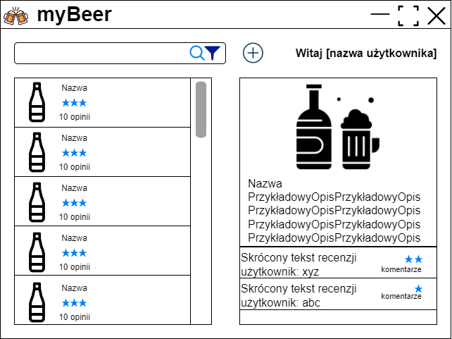

# Zespół_04

## Członkowie:

- Ignacy Dąbkowski
- Jakub Jażdżyk
- Ireneusz Okniński

## Opis projektu

Celem projektu będzie stworzenie aplikacji pozwalającej oceniać piwa. Każdy użytkownik(gość) naszego systemu będzie mógł
przeglądać recenzje, filtrować produkty według kategorii, oceny, etc. Zalogowani użytkownicy będą mogli tworzyć własne
recenzje oraz je komentować. Będą mogli także zaproponować dodanie do bazy danych nowego produktu. Wybór ten będzie
musiał być zatwierdzony przez administratora systemu.

## Struktura systemu

* Ignacy Dąbkowski
* Jakub Jażdżyk
* Ireneusz Okniński

### Aplikacja serwerowa (backend)

(Jakub Jażdżyk, Ireneusz Okniński)

* obsługa bazy danych
    * piwa
    * recenzje
    * oceny
    * komentarze
    * użytkownicy
* autoryzacja użytkowników
* REST API
* generowanie wykresów ocen etc.
* wdrożenie na serwer

Proponowana technologia: Django

### Testy

(Ignacy Dąbkowski)

* jednostkowe
* integracyjne

### Aplikacja desktopowa (webowa)

* Interfejs użytkownika (Ignacy Dąbkowski)
    * Lista piw
        * Wyszukiwanie po nazwie
        * Sortowanie
        * Filtrowanie
    * Wyświetlanie pojedynczego piwa
        * Dane
        * Recenzje (oceny)
            * Wyświetlanie komentarzy
            * Dodawanie komentarzy
        * Dodawanie recenzji
    * Dodawanie nowego piwa
    * Logowanie użytkownika
    * Rejestracja użytkownika

* Interakcja z API (Jakub Jażdżyk)
    * Tworzenie danych
        * Dodawanie piwa
        * Dodawanie recenzji
        * Dodawanie komentarzy
        * Rejestracja użytkownika
    * Pobieranie danych
        * Lista piw
        * Jedno piwo
        * Recenzje
        * Komentarze
        * Dane użytkownika
    * Edytowanie danych
        * Edytowanie recenzji
        * Edytowanie komentarza
    * Usuwanie danych
        * Usuwanie komentarzy
        * Usuwanie recenzji

Proponowana technologia: Java (Swing)

### Aplikacja administratora

(Ireneusz Okniński)

* Potwierdzanie dodania nowego produktu do bazy danych
* Zarządzanie użytkownikami
* Moderowanie recenzji i komentarzy

Proponowana technologia: Django + HTML + CCS + JavaScript

### Makieta głownego interfejsu

